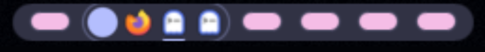

# noctalia-plugins

These are plugins I built for my own [Noctalia](https://noctalia.dev) v5
setup, written with the help of AI tooling. There are two: a streaming
Claude chat panel, and a niri workspace/taskbar widget. I use both daily
and share them here in case they help you too.

## Table of Contents

- [Plugins](#plugins)
  - [claude-launcher](#claude-launcher)
  - [niri-taskbar](#niri-taskbar)
- [Host Patches](#host-patches)
- [Install](#install)
- [Development](#development)
- [Credits](#credits)
- [License \& Disclaimer](#license--disclaimer)

## Plugins

### claude-launcher

A streaming chat panel for Claude, backed by your own `claude` CLI login.
It needs no API key; usage bills against your Pro/Max subscription.


**[Full README](./claude-launcher)**

### niri-taskbar

A bar widget that combines niri workspaces and a taskbar. Stretchable idle
chips expand on hover into a pill of real app-icon window tiles.



**[Full README](./niri-taskbar)**

## Host Patches

claude-launcher depends on a small set of patches to Noctalia itself.
Three add opt-in props or new bindings; one (0005) fixes a MarkdownView
measurement bug in the host. They sit in one open pull request.

niri-taskbar needs no patch anymore. Its container `onClick`/`onHover`
capabilities merged upstream on 2026-07-21
([#3470](https://github.com/noctalia-dev/noctalia/pull/3470)); a current
Noctalia build has everything the widget uses. The niri-taskbar README
documents how the widget degrades on older builds.

See **[`noctalia-patches/README.md`](./noctalia-patches/README.md)** for the
full patch list, current upstream status, and how to apply them.

## Install

**As a plugin source.** Noctalia clones and manages the repo itself; you
need no local checkout.

```sh
noctalia msg plugins source add gegnep-plugins git https://github.com/gegnep/noctalia-plugins
noctalia msg plugins enable gegnep/claude-launcher
noctalia msg plugins enable gegnep/niri-taskbar
```

**Symlink a single plugin** into Noctalia's local plugin directory. Use
this for local development, or if you'd rather manage the checkout
yourself.

```sh
git clone https://github.com/gegnep/noctalia-plugins
cd noctalia-plugins
ln -sfn "$PWD/claude-launcher" ~/.local/share/noctalia/plugins/claude-launcher
ln -sfn "$PWD/niri-taskbar" ~/.local/share/noctalia/plugins/niri-taskbar
```

## Development

```sh
nix develop   # or let direnv load it automatically
```

The devshell provides `luau`, `jq`, `fd`, and `ripgrep`: everything each
plugin's fixture harness needs. No running Noctalia instance is required.

```sh
noctalia plugins lint   # lint all plugin manifests and Luau sources
```

Each plugin has its own offline fixture harness; see the plugin's README
for what it covers. Run both from the repository root:

```sh
./claude-launcher/fixtures/dry-run.sh
./niri-taskbar/fixtures/dry-run.sh
```

`catalog.toml` is required for consuming this repo as a git plugin source.
`python3 tools/update-catalog.py` generates it from `*/plugin.toml` (CI
also runs this on push to `main`). Don't edit it by hand.

## Credits

Built on [Noctalia](https://noctalia.dev) by the
[noctalia-dev](https://github.com/noctalia-dev) team.

## License & Disclaimer

[MIT](./LICENSE).
