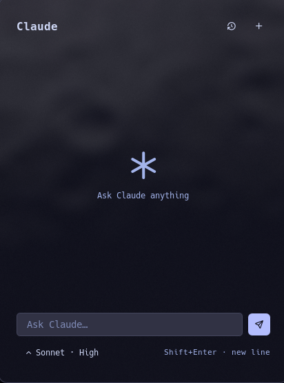
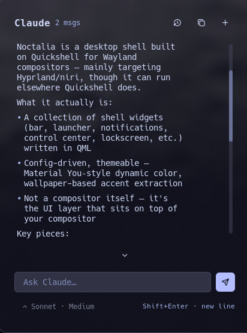
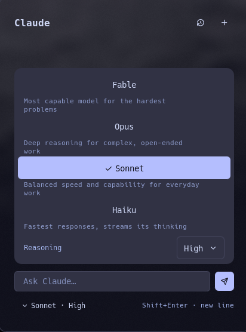
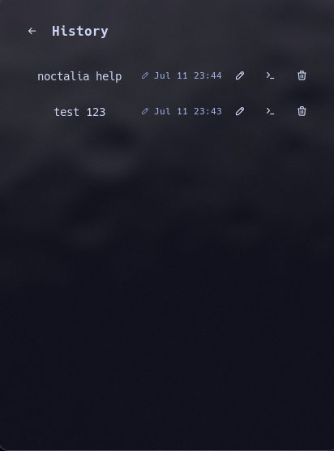

# claude-launcher

A streaming chat panel for [Claude](https://claude.com), backed by the
`claude` CLI (Claude Code) running in print mode. It shells out to your own
`claude` login, so usage bills against your Pro/Max subscription. The
plugin never talks to the Anthropic API directly and never holds an API
key.




*Not affiliated with, endorsed by, or sponsored by Anthropic. Claude is a
trademark of Anthropic PBC.*

## Table of Contents

- [Features](#features)
- [Requirements](#requirements)
- [Install](#install)
- [Usage](#usage)
- [Settings](#settings)
- [Notes and Limitations](#notes-and-limitations)
- [Development](#development)
- [License](#license)

## Features

- Streaming markdown responses (headings, lists, code, and more, via
  Noctalia's markdown control)
- Chat-style composer keybinds: Enter sends, Shift+Enter inserts a newline,
  Ctrl+Enter also sends
- Follow-scroll while a response grows, with a jump-to-latest pill once you
  scroll away from the bottom
- Claude.ai-style inline model picker, with per-model reasoning controls: a
  level select for Sonnet, Opus, and Fable, and an extended-thinking toggle
  for Haiku
- Model and reasoning effort lock once a conversation starts, and restore
  automatically when you reopen it later
- Chat history with rename; renamed chats carry a small pencil marker
- Two-step confirm before a history entry is deleted
- Continue any past chat in a terminal via `claude --resume`
- Past conversations reload their transcript from disk, so history is more
  than a title list
- Queued send: submit while a response is still streaming, and it sends the
  moment the current one finishes
- Cancel a queued message, or send it immediately
- Retry a failed message
- Stop a response mid-stream
- A login affordance opens a terminal for one-time `/login` when the CLI
  reports it isn't authenticated
- Tool use is off by default; the CLI runs with an empty tool set. An
  opt-in setting restores the model's normal tool behavior.

## Requirements

- A Noctalia v5 build with plugin API 21 or newer, i.e. one that includes
  [noctalia-dev/noctalia#3327](https://github.com/noctalia-dev/noctalia/pull/3327)
  (merged 2026-07-30). The manifest declares `plugin_api = 21`; older
  hosts refuse to load the plugin.
- The `claude` CLI (Claude Code), logged into a Pro/Max subscription.

Auth follows whatever `claude_command` actually runs. A sandboxed or
bwrapped `claude` wrapper works too. In that case, set the **Transcripts
directory** setting explicitly: a sandboxed process doesn't share a home
directory with the one Noctalia derives from. Log in interactively inside
that same sandbox once, before first use.

## Install

**As a plugin source.** Noctalia clones and manages the repo itself; you
need no local checkout.

```sh
noctalia msg plugins source add gegnep-plugins git https://github.com/gegnep/noctalia-plugins
noctalia msg plugins enable gegnep/claude-launcher
```

**Symlink** into Noctalia's local plugin directory. Use this for local
development, or if you'd rather manage the checkout yourself.

```sh
git clone https://github.com/gegnep/noctalia-plugins
cd noctalia-plugins
ln -sfn "$PWD/claude-launcher" ~/.local/share/noctalia/plugins/claude-launcher
```

## Usage

Bind a key to toggle the panel via IPC:

```sh
noctalia msg panel-toggle gegnep/claude-launcher:chat
```

In the panel: type in the composer and send. Switch model and reasoning
effort before your first message; both lock afterward. Open History from
the header to reload, rename, delete, or continue a past chat in a
terminal. Use New Chat to start fresh.




| Key | Action |
|---|---|
| Enter | Send |
| Shift+Enter | New line |
| Ctrl+Enter | Send |

## Settings

| Key | Type | Default | Description |
|---|---|---|---|
| `claude_command` | string | `claude` | Path or name of the claude binary (point at a wrapper to sandbox it) |
| `transcripts_dir` | folder | *(empty)* | Claude projects dir used to reload past conversations; empty auto-derives from the workspace path (sandboxed claude wrappers must set this explicitly) |
| `model` | select | `auto` (first in list) | Model new chats start with: `auto`, `claude-sonnet-5`, `claude-opus-5`, `haiku`, `claude-fable-5` |
| `models` | string_list | `["claude-sonnet-5", "claude-opus-5", "haiku", "claude-fable-5"]` | Model aliases offered by the in-panel switcher |
| `effort` | select | `auto` (default/high) | Default reasoning level for new chats: `auto`, `low`, `medium`, `high`, `xhigh`, `max` |
| `allow_tools` | bool | `false` | Off: claude runs with all tools disabled. On: claude's default tool behavior |

## Notes and Limitations

- Thinking text only streams for Haiku. Other models send encrypted
  reasoning at the API level; the plugin has no visibility into it. The
  extended-thinking toggle only affects Haiku.
- Markdown links render underlined but aren't clickable; the markdown
  control has no click API yet.
- Model and effort stay fixed for the lifetime of a conversation. Start a
  new chat to switch.
- There is no usage or quota display. Pro/Max rate-limit windows are
  server-side and opaque, so the plugin doesn't estimate "percent of
  limit."

## Development

```sh
nix develop   # or let direnv load it automatically
```

The devshell provides `luau`, `jq`, `fd`, and `ripgrep`: everything the
fixture harness needs. No running Noctalia instance is required.

Lint the manifest and Luau sources:

```sh
noctalia plugins lint claude-launcher
```

Run the fixture-driven parser tests:

```sh
./claude-launcher/fixtures/dry-run.sh
```

The fixture harness feeds `panel.luau`'s parser and transcript loader with
real captured data, outside of Noctalia. Inputs are `claude
--output-format stream-json` output (with and without
`--include-partial-messages`), plus a sample transcript file. See
[`fixtures/parser-spec.md`](./fixtures/parser-spec.md) for the full state
machine the parser implements.

Everything lives in a single `panel.luau` file, with no separate service.
Claude runs with its working directory pinned to a dedicated workspace
under `$XDG_STATE_HOME/noctalia-claude-launcher/workspace`, not your home
directory. When `XDG_STATE_HOME` is unset, that resolves to
`~/.local/state/noctalia-claude-launcher/workspace`.

## License

[MIT](../LICENSE).
