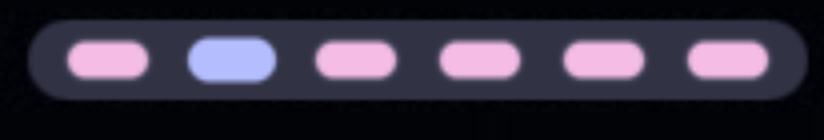

# niri-taskbar

A combined workspace/taskbar bar widget for [niri](https://github.com/YaLTeR/niri),
built for [Noctalia](https://noctalia.dev) v5. It renders compact workspace
chips colored like Noctalia's native workspaces widget (active = primary,
occupied = secondary, urgent = error, empty = muted), and on hover a chip
rounds out and grows into a tinted pill containing real app-icon tiles for
every window on that workspace.




niri only; it drives itself entirely off `niri msg --json event-stream`.

## Table of Contents

- [Features](#features)
- [Requirements](#requirements)
- [Install](#install)
- [Settings](#settings)
- [Notes and Limitations](#notes-and-limitations)
- [Development](#development)
- [License](#license)

## Features

- Workspace chips matching the native workspaces widget's palette: active =
  primary, occupied = secondary, urgent = error, empty = muted
- Idle chips are stretchable via `chip_ratio`, from a 100% circle to a 400%
  line (default 140%, a compact oval), and always round back into a circle
  on hover
- Hover a chip to expand it into a tinted pill (a primary hairline border
  around app-icon tiles for every window on that workspace), fading in and
  out at a configurable speed (`expand_speed`); click a tile to focus that
  window
- The focused window's tile gets a primary dot underneath it; an urgent
  window gets an error-colored dot instead (`show_focus_dot`)
- Four label modes (`display`): workspace id, name (falls back to id),
  window count, or a bare pill with no label
- Per-workspace hover: hovering one chip expands only that chip, not every
  chip on the bar (needs the `onHover` patch; see Requirements)
- Click a chip to focus its workspace; on a multi-monitor setup this chains
  a focus-monitor call first so cross-monitor chip clicks land correctly
- Windows within an expanded chip are ordered by niri's own scrolling-layout
  column/window position, not arrival order
- Scoped to its own monitor by default, or the compositor's focused monitor
  regardless of which bar instance you're looking at (`focused_output_only`,
  needs `barWidget.outputName`, shipped upstream; see Requirements)
- Live via `niri msg --json event-stream`, with a 30-second self-healing
  resync in case an event is ever missed
- Real app icons resolved through Noctalia's own icon machinery (needs
  `noctalia.appIconPath`, shipped upstream), falling back to an
  initial-letter tile otherwise

## Requirements

- niri as the compositor.
- A Noctalia v5 build. The widget runs on stock Noctalia but looks and
  behaves best with everything below available. Two capabilities shipped
  upstream and just need a current build; the other two still need a local
  patch from [`../noctalia-patches/`](../noctalia-patches); see that
  directory's README for what each one does and how to apply them.

  | Capability | Adds | Without it |
  |---|---|---|
  | `barWidget.outputName` (upstream, merged [#3352](https://github.com/noctalia-dev/noctalia/pull/3352)) | Scopes the widget to its own monitor | Every instance shows all outputs' workspaces |
  | `noctalia.appIconPath` (upstream, merged [#3356](https://github.com/noctalia-dev/noctalia/pull/3356)) | Native icon resolution for window tiles | Tiles fall back to an initial-letter glyph |
  | 0007 button radius/padding (local patch, [#3355](https://github.com/noctalia-dev/noctalia/pull/3355) open) | Capsule-shaped chips | Square chips |
  | 0008 `onHover` on button/box/image (local patch, no PR yet) | Per-workspace hover (only the hovered chip expands) | Hovering any chip expands all of them (with a short collapse-grace fallback) |

## Install

**As a plugin source** (Noctalia clones and manages the repo itself, no
local checkout needed):

```sh
noctalia msg plugins source add gegnep-plugins git https://github.com/gegnep/noctalia-plugins
noctalia msg plugins enable gegnep/niri-taskbar
```

Or add the repo as a plugin source in Settings, Plugins, and install
**Niri Taskbar** from the plugin browser.

**Symlink** into Noctalia's local plugin directory (for local development or
if you'd rather manage the checkout yourself):

```sh
git clone https://github.com/gegnep/noctalia-plugins
cd noctalia-plugins
ln -sfn "$PWD/niri-taskbar" ~/.local/share/noctalia/plugins/niri-taskbar
```

Then add the **Niri Taskbar** widget from Settings, Bar, like any other bar
widget.

## Settings

| Key | Type | Default | Description |
|---|---|---|---|
| `focused_output_only` | bool | `false` | Show only the focused monitor's workspaces instead of this monitor's |
| `show_empty_workspaces` | bool | `true` | Show chips for workspaces with no windows (the active workspace is always shown) |
| `display` | select | `id` | What each chip shows: the workspace index (`id`), its name falling back to the index (`name`), its window count (`windows`), or a bare pill (`none`) |
| `window_titles` | select | `off` | Truncated window title next to tiles: `off`, `hover` (only the tile under the pointer), or `always` (forced off in a vertical/side bar) |
| `max_windows_per_workspace` | int | `10` | Cap on expanded window tiles per workspace before collapsing the rest into a `+N` label |
| `labels_only_when_occupied` | bool | `false` | Hide the label on empty, inactive workspace chips, leaving a bare pill |
| `max_label_chars` | int | `1` | Truncate workspace name labels to this many characters (purely numeric labels are never truncated) |
| `only_active_workspace` | bool | `false` | Show window tiles only for each monitor's active workspace; other workspace chips still render |
| `icon_size` | int | `16` | Window app icon size in pixels |
| `chip_size` | int | `16` | Workspace chip diameter |
| `chip_ratio` | int | `140` | Idle chip width-to-height ratio (%): 100 is a circle, 140 a compact oval, 300+ approaches a line; chips always round into circles on expand (labels hide when the chip is too flat to fit them) |
| `chip_spacing` | int | `3` | Spacing between workspaces |
| `collapse_delay_ms` | int | `1250` | Hover linger before collapse, in milliseconds |
| `expand_speed` | select | `normal` | Expand animation speed: `fast`, `normal`, or `slow` |
| `show_focus_dot` | bool | `true` | Show a dot under the focused (primary) and urgent (error-colored) windows' tiles |
| `pill_tint` | int | `30` | Expanded pill tint strength, as a percentage |

## Notes and Limitations

- Labels auto-hide on very flat idle chips (high `chip_ratio`) since there's
  no room to render text.
- Without the `onHover` patch, hovering any chip expands all of them, with a
  short collapse-grace fallback instead of true per-workspace hover.
- The 30-second resync only replaces state if nothing changed while it was
  in flight; a live event always wins over a stale snapshot.

## Development

```sh
nix develop   # or let direnv load it automatically
```

Linting the manifest and settings wiring does not parse Luau; the fixture
harness below is the real code gate.

```sh
noctalia plugins lint niri-taskbar   # lint the manifest and settings wiring
./niri-taskbar/fixtures/dry-run.sh   # run the offline fixture harness
```

The fixture harness feeds captured `niri msg --json event-stream` output,
workspace/window snapshots, and icon-resolution scenarios through
`taskbar.luau`'s parser and render logic, checking the resulting state
against expectations. See
[`fixtures/parser-spec.md`](./fixtures/parser-spec.md) for the event state
machine.

If niri changes its IPC event shape in a future release, re-derive the
fixtures and spec from a live session:

```sh
./niri-taskbar/fixtures/capture-dumps.sh
```

Everything lives in a single `taskbar.luau` (no separate service). It holds
workspace/window state in memory, keyed by niri's own ids, and reconciles
on every IPC event plus the periodic resync.

## License

[MIT](../LICENSE).
